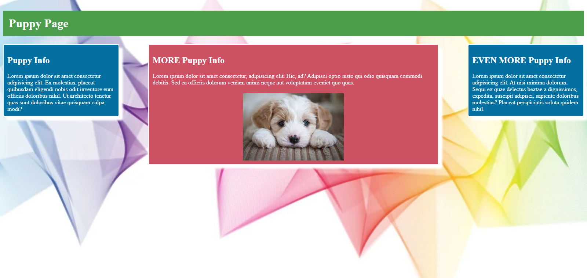
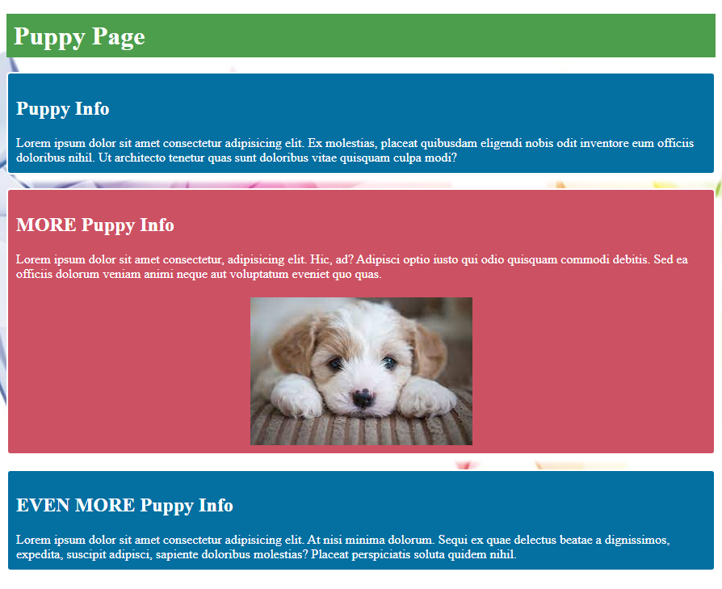
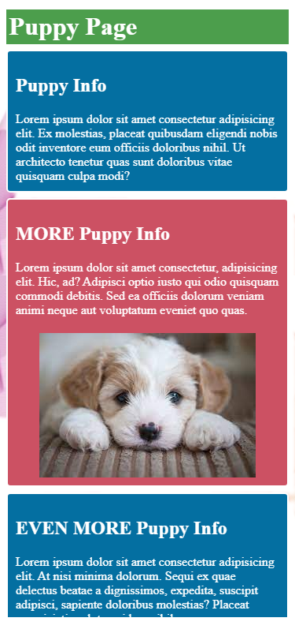

 

# CSS-practice

### Description  
This application was developed to demonstrate the basics of CSS, without the use of a CSS library. Within the style.css, there are examples of common usages of floats, background images, div styling, box-sizing, box-shadows, padding, margins, and responsive web design/medi queries. This application utilizes these features in order to display the ease of which developers can create their own visually appealing webpages utilizing basic CSS.

### Table of Contents  
[Description](#description)  
[Installation](#installation)  
[Usage](#usage)  
[Contributing](#contributing)  
[Tests](#tests)  
[License](#license)  
[Questions](#questions)  

### Installation  
N/A

### Usage  
N/A  

### Contributing  
Contributions provided by: N/A

### Tests  
N/A

### License  
This application is covered under the MIT license

### Questions  
For further questions, please contact me at:
averybgcoding@gmail.com  
[Github link](https://unchar.bootcampcontent.com/averyjbrown2/)  

### Images  
#### >1024px View
 &nbsp;        

#### <1024px View
 &nbsp;    

#### Small Screen View
 &nbsp;  